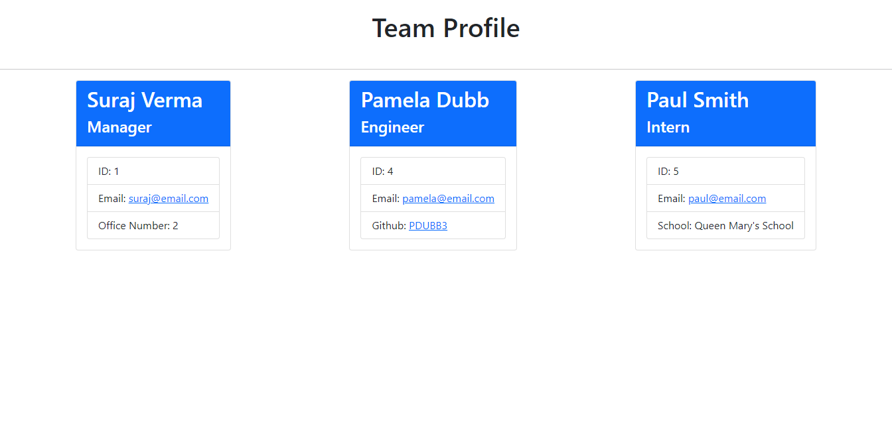

## Team-Profile-Generator

<h2> Table of Contents </h2>

- [Project Link](#project-link)
- [Description](#description)
- [What did we do](#what-did-we-do)
- [Getting Started](#getting-started)
- [Screenshots](#screenshots)
- [Walkthrough Video](#walkthrough-video)

## Project Link

Click [here](https://pdubb3.github.io/team-profile-generator/) to view project on Github pages

## Description

In this project, I have build a node.js command line application that takes in information about employees on a software engineering team, then generates a HTML webpage that displays summaries for each person. I have also tested the code by writing a unit test for every part of the code, to ensure the code is maintainable and passes each test.

## What did we do?

Generate a web[age that displays my team's basic information so that I have quick access to their emails and Github profiles.

- [x] Given a command-line application that accepts user input
- [x] When I am prompted for my team members and their information, then an HTML file is generated that displays a nicely formatted team roster based on user input
- [x] When I click on an email address in the HTML, then my default email program opens and populates the TO field of the email with the address
- [x] When I click on the GitHub username, then that GitHub profile opens in a new tab
- [x] When I start the application, then I am prompted to enter the team manager’s name, employee ID, email address, and office number
- [x] When I enter the team manager’s name, employee ID, email address, and office number, then I am presented with a menu with the option to add an engineer or an intern or to finish building my team
- [x] When I select the engineer option, then I am prompted to enter the engineer’s name, ID, email, and GitHub username, and I am taken back to the menu
- [x] When I select the intern option, then I am prompted to enter the intern’s name, ID, email, and school, and I am taken back to the menu
- [x] When I decide to finish building my team, then I exit the application, and the HTML is generated

## Getting started

- Create a new GitHub repository called team-profile-generator
- Clone github project onto your local machine
- Navigate into the project
- Open the project into VS code

```
git clone git@github.com:PDUBB3/team-profile-generator.git
cd readme-generator
code .
```

- Repo to include a `package.json` file by running `npm init -y` when you first set up the project.
- Add `start`, `test ` and `test:watch` script to `package.json`
- Use `jest` for running unit tests and inquirer for collecting input from the user, using the command `node index.js`

Installation

```
npm i
npm i inquirer
npm i jest -D
npm i @types/jest -D

```

Run

```
npm run start

```

Test with coverage

```
npm run test

```

Test with watch

```
npm run test:watch

```

## Screenshots



Click [here](./dist/team.html) to view example of readme file generated

## Walkthrough Video

Click [here](https://drive.google.com/file/d/1kGHzCdRpyUNATIAsqauTuiXvN0E6A7fK/view?usp=sharing) to view my walkthrough video on
Click [here](https://drive.google.com/file/d/1kGHzCdRpyUNATIAsqauTuiXvN0E6A7fK/view?usp=sharing) to view my walkthrough video on Javascript testing.
